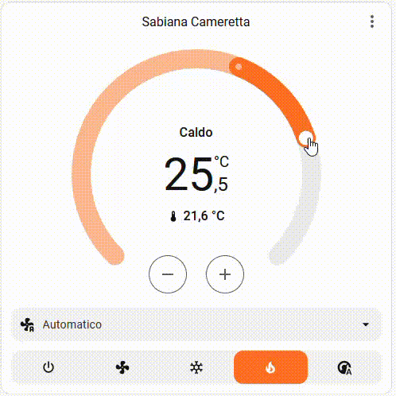
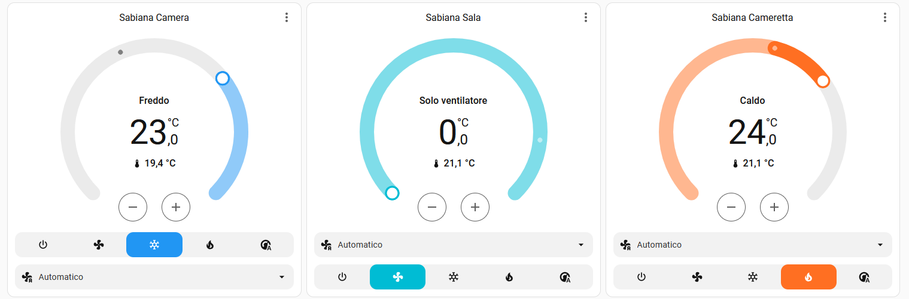
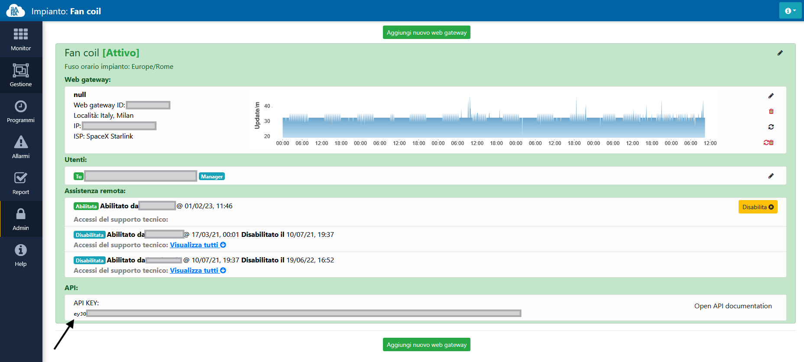
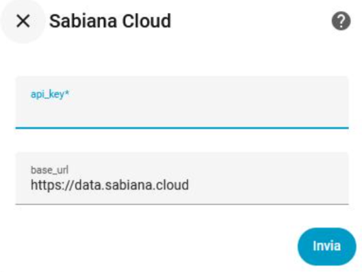

##   Sabiana Cloud for Home Assistant  
  

**Sabiana Cloud** is a custom integration for Home Assistant that allows you to monitor and control Sabiana connected to the Sabiana Cloud services:
- Fan-coils            
- Heat recovery unite         
- Iot          
- Power meter
        

✅ Works via official Sabiana Cloud endpoints  
✅ Auto-discovers all units (groups, rooms, devices)  
✅ Provides temperature, mode, fan speed, setpoints, alarms, and more  
✅ Supports configuration through the Home Assistant UI  
✅ Supports HACS installation

---
##  

##  

---
## ✅ Features

Per each fan-coil, this integration exposes:

### **Primary sensors**
- Power (on/off)
- Mode (heating / cooling / auto)
- Fan speed
- Setpoint Heating
- Setpoint Cooling
- Temperature T1 (room)
- Temperature T3 (water)

### **Diagnostic sensors**
(disabled by default, can be enabled in the UI)
- With active alarms (boolean)
- Active alarms list
- Last update timestamp
- Controller / limits / lock states

---

## ✅ HACS Automatic install (Racommended)

## ✅ HACS (Manual Installation)
1. Open HACS inside your Home Assistant instance
2. Go to Integrations
3. Click the ⋮ (menu) in the top-right corner and select “Custom repositories”
4. Add the following repository URL:
5. https://github.com/ivanb1989/sabiana-cloud
6. Set the category to Integration
7. Confirm and install Sabiana Cloud from the list
8. Restart Home Assistant once the installation is complete

---

## ✅ Configuration

✅ Where to get your Sabiana Cloud API Key
1. Access your Sabiana Cloud portal
2. Open Admin → Web Gateway
You will see the API section like this:

##  

The field API KEY contains your private access token.
Select and copy the full string.

✅ Step 2 — Insert API Key in Home Assistant
When adding the integration:
1. Go to Settings → Devices & Services → Add Integration
2. Search Sabiana Cloud
3. Paste the key into the field api_key
4. Leave the default https://sabiana.cloud/app/admin unless instructed otherwise
Click Submit

##  

✅ If the API key is invalid
You will see an error such as: 
. Authentication failed
. 401 Unauthorized
. Invalid token
In this case, re-copy the API key and retry.

✅ Security note

The API Key grants full access to your Sabiana fan-coils.
**Never publish it in screenshots, GitHub issues or logs.**

---

## ✅ Entities Created

Example sensor names:

| Entity ID | Description |
|-----------|-------------|
| `sensor.sabiana_room_89_power` | Power state (On/Off) |
| `sensor.sabiana_room_89_mode` | Current HVAC mode (heating / cooling / auto) |
| `sensor.sabiana_room_89_fan` | Fan mode (auto / low / medium / high) |
| `sensor.sabiana_room_89_t1` | Room air temperature |
| `sensor.sabiana_room_89_t3` | Water temperature |
| `sensor.sabiana_room_89_setpoint_heating` | Heating temperature setpoint |
| `sensor.sabiana_room_89_setpoint_cooling` | Cooling temperature setpoint |
| `sensor.sabiana_room_89_request` | Thermal request (On/Off) |
| `sensor.sabiana_room_89_name` | Reported device name |
| `sensor.sabiana_room_89_address` | Sabiana Cloud device address |

Diagnostic sensor:

| Entity ID | Description |
|-----------|-------------|
| `sensor.sabiana_room_89_last_update` | Last update timestamp received from cloud |
| `sensor.sabiana_room_89_active_alarms` | List of active alarms reported by the unit |
| `sensor.sabiana_room_89_with_active_alarms` | Boolean: the unit has at least one active alarm |
| `sensor.sabiana_room_89_setpoint_auto_mode` | Auto-mode setpoint (if supported by the controller) |
| `sensor.sabiana_room_89_unit_type` | Reported Sabiana unit type (e.g. VentUnit) |

Additional technical sensors (disabled by default):

| Entity ID | Description |
|-----------|-------------|
| `sensor.sabiana_room_89_automode_available` | Auto mode supported by controller |
| `sensor.sabiana_room_89_controller_type` | Reported controller type (e.g. 5003) |
| `sensor.sabiana_room_89_flap` | Flap state (if available) |
| `sensor.sabiana_room_89_lock_all_features` | Device lock: all features |
| `sensor.sabiana_room_89_lock_fan` | Device lock: fan control |
| `sensor.sabiana_room_89_lock_mode` | Device lock: HVAC mode |
| `sensor.sabiana_room_89_lock_onoff` | Device lock: power |
| `sensor.sabiana_room_89_lock_set` | Device lock: setpoints |
| `sensor.sabiana_room_89_slave` | Unit slave configuration |
| `sensor.sabiana_room_89_t2` | Temperature sensor T2 (if provided) |
| `sensor.sabiana_room_89_setpoint_auto_mode` | Auto-mode setpoint |
| `sensor.sabiana_room_89_setpoint_auto_mode_range` | Auto-mode setpoint range |
| `sensor.sabiana_room_89_setpoint_cooling_min` | Cooling setpoint minimum |
| `sensor.sabiana_room_89_setpoint_cooling_max` | Cooling setpoint maximum |
| `sensor.sabiana_room_89_setpoint_heating_min` | Heating setpoint minimum |
| `sensor.sabiana_room_89_setpoint_heating_max` | Heating setpoint maximum |
| `sensor.sabiana_room_89_unit_type` | Reported unit type |

You can enable or disable additional sensors from the **Device** page.

---

## ✅ Troubleshooting

- If sensors or devices do not appear, reload the integration:  
  **Settings → Devices & Services → Sabiana Cloud → Reload**
- Check logs using:  
  **Developer Tools → Logs → custom_components.sabiana_cloud**
  

---

## ✅ Contribute / Issues

You can report bugs or request features here:
👉 https://github.com/ivanb1989/sabiana-cloud/issues

Pull requests are welcome.

---

✅ Disclaimer

This is a community-made integration and is not an official Sabiana product.
It uses the public Sabiana Cloud API endpoints, without modifying or bypassing any security mechanism.
If Sabiana Cloud changes its platform, authentication or API structure, updates may be required.

✅ Device support
Device type	Status
Vent 	✅ Fully supported
RVU	🚧 Planned support
Power Meter	🚧 Planned support
Io 🚧 Planned support

Future releases will expand device compatibility and UI controls as soon as documentation and testing are completed.

## ✅ License
Apache 2.0 – free to use, modify and distribute.

